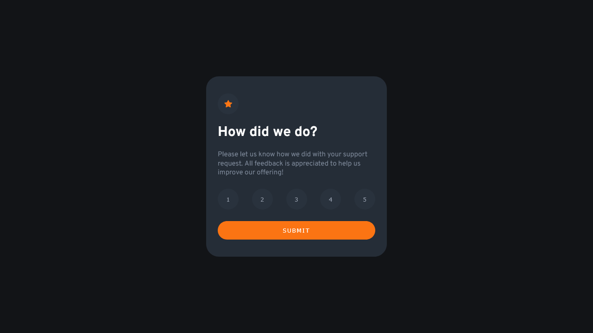

# Frontend Mentor - Interactive rating component solution

This is a solution to the [Interactive rating component challenge on Frontend Mentor](https://www.frontendmentor.io/challenges/interactive-rating-component-koxpeBUmI). Frontend Mentor challenges help you improve your coding skills by building realistic projects. 

## Table of contents

- [Overview](#overview)
  - [The challenge](#the-challenge)
  - [Screenshot](#screenshot)
  - [Links](#links)
- [My process](#my-process)
  - [Built with](#built-with)
  - [What I learned](#what-i-learned)
  - [Continued development](#continued-development)
  - [Useful resources](#useful-resources)

## Overview

### The challenge

Users should be able to:

- View the optimal layout for the app depending on their device's screen size
- See hover states for all interactive elements on the page
- Select and submit a number rating
- See the "Thank you" card state after submitting a rating

### Screenshot

### Links

- Solution URL: 
- Live Site URL: 

## My process

### Built with

- [React](https://reactjs.org/) - JS library
- SASS
- Flexbox

### What I learned

I've had to remember some concepts regarding React library, mostly related to state elevation and props. Also, had to go look through some media query examples to work on the component responsiveness.

### Continued development

I guess I have a lot to work on the CSS usage, because I feel I'm not very organized enough. Also, I'm willing to improve my skills with JS libraries/frameworks on future projects.

### Useful resources

- [Origamid](https://origamid.com/projetos/flexbox-guia-completo/) - Whenever I have doubts around flexbox, I look into this awesome guide from Origamid.
